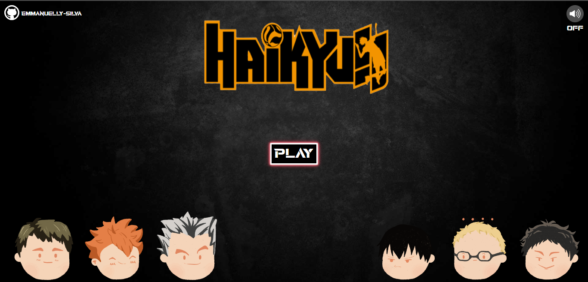
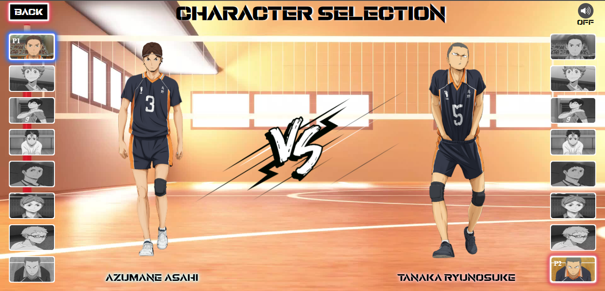

<h1 align="center">Haikyuu-Game-Menu</h1>
 

## 💻 Sobre o projeto:

Esse projeto foi desenvolvido com base no conhecimento adquirido durante a **MAPADEV WEEK** realizada pelo canal <a href="https://www.youtube.com/c/DevemDobro">**DEV em Dobro**</a>.
 
O objetivo do projeto era criar um menu de seleção de personagens semelhante aos de jogos de video-games.
  

## 🖌️ Layout:

O layout do projeto tem como tema o anime **Haikyuu**.
  

  

 

## 🛠 Tecnologias:

As seguintes tecnologias foram usadas no desenvolvimento do projeto:

  
  
  

 

## 💡 Como acessar o projeto:
#### Para acessar basta clicar no link a seguir: https://emmanuelly-silva.github.io/Haikyuu-Game-Menu/.
<i>Durante o teste do projeto, é possível ativar e desativar a música de fundo.</i>
  

## 📝 Autora:
⚡ Emmanuelly Lavínia da Silva

<!--O projeto provavelmente será atualizado com:
* Novos personagens-->
<!---->
